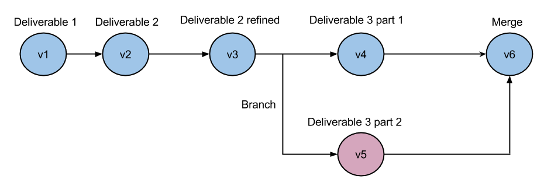

---

layout: custom

style: |

    #Cover h2 {
        margin:30px 0 0;
        color:#FFF;
        text-align:center;
        font-size:70px;
        }
    #Cover p {
        margin:10px 0 0;
        text-align:center;
        color:#FFF;
        font-style:italic;
        font-size:20px;
        }
        #Cover p a {
            color:#FFF;
            }
    #Picture h2 {
        color:#FFF;
        }
    #SeeMore h2 {
        font-size:80px
        }
    #SeeMore img {
        width:0.72em;
        height:0.72em;
        }

    #code-management img {
        width: 100%;
        }

    #project-management img {
        position: relative;
        top: -50px;
        width: 90%;
        }

    #vcs img {
           width: 50%;
        }
    #gist img {
           width: 50%;
        }
---

# Introduction to Github {#Cover}

*Brought you by [John Sun](mailto:johns@cse.unsw.edu.au) and generated by [Jekyller](https://github.com/shower/jekyller)*

<!-- photo by John Carey, fiftyfootshadows.net -->

## Outline

* Version Control System
* Git
* Github

## Version Control System (VCS) {#vcs}

1. Code Management
2. Project Management

<!-- photo from atlassian http://blogs.atlassian.com/2013/04/git-flow-comes-to-java/ -->

<!--
{:.note}
Shower
-->

## Code Management

<!--
TODO: figure
-->
1. ...Maintaining versions of artifacts - Commits (code, documents...)
1. ...Reverting previous changes
1. ...Comparing differences between versions

## Project Management

1. ...Branching
1. ...Merging
1. ...Synchronizing files
1. ...Tracing

## Why do we need VCS

<figure markdown="1">

> Nobody actually creates perfect code the first time around, except me. But
> there's only one of me.

<figcaption>Linus Torvalds</figcaption>
</figure>

## Modern VCS

* Subversion (svn) - Apache
* Bazaar (bzr) - Canonical
* Mercurial (hg) - Matt Mackall
* Git (git) - Linus Torvalds
* And many others...

## Git

1. Open Source
1. Compatibility with existing systems and protocols (git-svn git-hg, http, https)
1. Used for Linux development - production ready

## Basic Workflow - Concepts

* Repository
* Commit
* Branch
* Merge

## Basic Workflow - Initialization

`git init .`

Initialize an empty repository. This will create a `.git` folder in the current directory

## Basic Workflow - Commit

1. `git add somefile.c`
1. `git commit -m 'Initial import'`
1. `git log`

## Basic Workflow - Commit (Cont.)

	commit 87f797c45a4c7b1b5396cf2aea4e6052cbed9f1d
	Author: Freehaha <freehaha@gmail.com>
	Date:   Mon Aug 11 11:08:41 2014 +1000

		Initial import

## Basic Workflow - Push

`git push`

Pushes your local commits to central server. Abort if there are conflicts.

## Basic Workflow - Pull

`git pull` (= git fetch + merge)

Pulls new commits from server and merge with your local copy.

## Learn more about Git

* [Learn Git](http://pcottle.github.io/learnGitBranching/?demo)
* [Try Git](https://try.github.io)
* [Atlassian](https://www.atlassian.com/git/tutorial)
* [Git manual](http://git-scm.com/docs/gittutorial)

## Github

Github is a service built on git, providing free hosting for projects and
is one of the most popular hosting site for open source projects.

{:.note}
*Private repositories are also available for paid users.*

## Github - Features

1. ...Code Repository (includes all features of git)
1. ...Collaboration tools (fork, pull requests, merging on-the-fly)
1. ...Issue Tracker/Wiki
1. ...[APIs](https://developer.github.com/v3/)
1. ...[GitHub Pages](https://pages.github.com/)

## Github Pages

1. static page hosting (static html files, images, javascripts)
1. uses the **gh-pages** branch from every project

## What People Have Been Using Github For

1. Blogging [Jekyll](http://jekyllrb.com/), [Octopress](http://octopress.org/)
2. Presentations [Jekyller](https://github.com/shower/jekyller), [hekyll](http://bmcmurray.github.com/hekyll)
3. Writing books [GitBook](https://www.gitbook.io/)
4. Continuous Integration (CI) [Travis CI](https://travis-ci.org/),
   [Codeship](https://www.codeship.io/) and many others
5. Package management [npm](https://www.npmjs.org/), [bower](http://bower.io/) ...

<!--
## You can even shout this way
{:.shout}
-->

## Questions?

Link to this slide:
[http://freehaha.github.io/github-intro/](http://freehaha.github.io/github-intro/)

